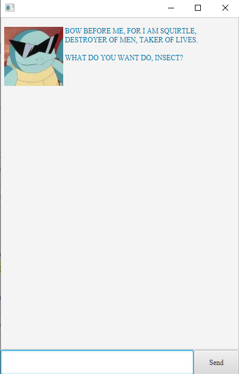

# User Guide

## How to use Duke

### Prerequisites
1. Ensure that your version of Java is 11 or higher
2. Download the latest version of Duke [here](https://github.com/bentanjunrong/ip/releases)

## What is Duke?

Duke is a chatbot that can help you manage your tasks!

Check out his immense swag and power.

## Features

### *Task Management*
### `event`
Adds an Event task to the list

### `deadline`
Adds a Deadline task to the list

### `todo`
Adds a ToDo task to the list

### `list`
Lists all the tasks in the list

### `delete`
Removes a task from the list

### `done`
Marks a task in the list as done

### *Miscellaneous*

### `help`
Provide in-App guidance to users
 

## Usage

### `event` -  Adds an Event task to the list

Format:

`event <description> /at <datetime>`

Example of usage:

`event return book /at 02/12/2021 1800`

Expected outcome:

Adds a Event task with the description "return book" and the date "02 Dec 2021" into the list.

 

### `deadline` - Adds a Deadline task to the list

Format:

`deadline <description> /by <date>`

Example of usage:

`deadline return book /by 02/12/2021 1800`

Expected outcome:

Adds a deadline task with the description "return book" and the date "02 Dec 2021" into the list.

 

### `todo` - Adds a ToDo task to the list

Format:

`todo <description>`

Example of usage:

`todo join sports club`

Expected outcome:

Adds a ToDo task with the description "join sports club" to the list.

 

### `list` - Lists all the tasks in the list

Format:

`list`

Example of usage:

`list`

Expected outcome:

Displays a list of tasks in chronological order. With the oldest task being in the first position.

 

### `delete` - Removes a task from the list

Format:

`delete <index>`

Example of usage:

`delete 1`

Expected outcome:

Removes  1st task in the list.

 

### `done` - Marks a task in the list as done

Format:

`done <index>`

Example of usage:

`done 1`

Expected outcome:

Marks 1st task in the list as completed.

 

